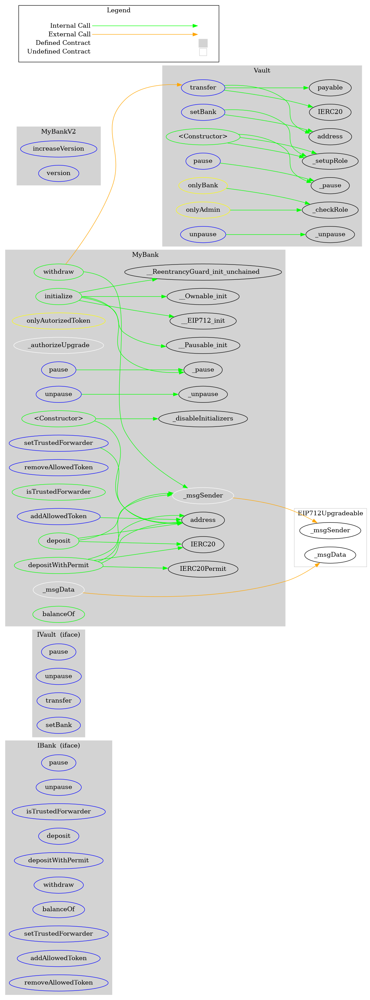

# My Bank

This is a Foundry project.

Install the latest release by using foundryup

This is the easiest option for Linux and macOS users.

Open your terminal and type in the following command:

```
curl -L https://foundry.paradigm.xyz | bash
```

This will download foundryup. Then install Foundry by running:

```
foundryup
```

If everything goes well, you will now have four binaries at your disposal: forge, cast, anvil, and chisel.

## Installation

### Note on lavamoat

Lavamoat's allow-scripts configures your project to disable running install scripts by default and gives you a configuration section in package.json where the allowed ones can be listed.
It also installs a package with an install script that fails installation as early as possible if the configuration is accidentally removed.

No new install scripts showing up in your dependencies will run unexpectedly. That way you eliminate the most popular attack vector of malicious packages in recent years.


### Note on NodeJS
we are using node version manager to manage node versions. 
the `.nvmrc` file specifies the node version we are using. Make sure you are running the same version as specified in the `.nvmrc` file.

To install :

```
yarn && forge install [user]/[repo]
```

## Local development

This project uses [Foundry](https://github.com/gakonst/foundry) as the development framework.

### Dependencies

```
forge install
```

### Compilation

```
yarn build
```

### Testing

```
yarn test
```

### Linting

```
yarn prettier
```

### Contract deployment

Please create a `.env` file before deployment. An example can be found in `.env.example`.
Deployment script will deploy the contracts to the network specified in the `RPC_URL` environment variable.
It includes the proxy contracts and the `MyBank` implementation, the `Vault` and a `mockERC20`. It will also initialize `MyBank` with the `Vault` address, unpause both and grant Bank a role to be able to withdraw from the vault.

 

#### local

 we can leverage anvil to run a local node and deploy contracts to it.
 __ Note that source will load the .env file and so your PRIVATE_KEY will be available in your shell session. __

```
source .env && anvil --fork-url $RPC_URL_MAINNET --steps-tracing
```
you can also run anvil with a mnemonic

```
source .env && anvil --fork-url $RPC_URL_MAINNET --steps-tracing --mnemonic $MNEMONIC
```


and now we can deploy contracts to the local node

dryrun:
 
```
forge script script/Deploy.s.sol -f http://localhost:8545 
```

live:
```
forge script script/Deploy.s.sol -f http://localhost:8545 --broadcast
```


#### Dryrun for live networks


```
forge script script/Deploy.s.sol -f [network]
```

### Live networks

```
forge script script/Deploy.s.sol -f [network] --verify --broadcast
```

e.g. deployment : https://goerli.etherscan.io/address/0xb0ea320ad62e9552c63cb4d9bca3d559c67f9827


# Architecture


## Contracts

We have 2 contracts in this project:

- `MyBank` is the main contract that implements the bank functionality. It is a proxy contract that delegates calls to the implementation contract. The proxy is an UUPS proxy in order to save gas on each call. Note that a bad upgrade could break the bank this have to be handle with care a good explanation on proxies can be found [here](https://docs.openzeppelin.com/upgrades-plugins/1.x/proxies) and a comparison between transparent vs UUPS proxies [here](https://docs.openzeppelin.com/contracts/4.x/api/proxy#transparent-vs-uups).  


- `MyBankV2` is just here to give an example for an upgrade of `MyBank`.

- `Vault` is the contract that holds the funds of the bank. It cannot be upgraded and only contains a few functions. This is to avoid the risk of a bad upgrade breaking the bank and to reduce the surface of attack. Only address with `Bank role` can transfer from the vault. The choice of having one contract to hold all the tokens is also motivated by the fact that it opens the possibility to have send some tokens to another protocol (e.g. Aave) and earn interest on them. It can also reduce the gas cost for each internal transfer (from one bank account to another) as the tokens will sit there and only the internal bank balance will be updated. We could also provide swap between tokens in the future. Note that this pattern is also used by balancer in their [V2 vault](https://medium.com/balancer-protocol/balancer-v2-generalizing-amms-16343c4563ff).

## Features

### Deposit
You can deposit tokens to `MyBank` by calling the deposit function. Note that if you a send a token directly to the contract it can't be rejected and there is no way at the moment to retrieve it (check next steps). This will update the balance of the sender and the total balance of the bank. The tokens will be sent to the vault. 

Note that for gas efficiency there is no follow up and the total supplied to the bank. If we have to track that amount we could upgrade in the future. Now if tokens are mistakenly sent to the bank an admin will have ato do a manual transaction . 

### Deposit with permit

You can deposit tokens to `MyBank` by calling the depositWithPermit function. For tokens that supports `ERC20Permit` i.e `USDC`. This will act like `deposit` without having to pay another transaction to approve the token transfer from the bank .

### Withdraw

You can withdraw tokens from `MyBank` by calling the withdraw function. This will update the balance of the sender and the total balance of the bank. The tokens will be sent to the sender from the vault.
 

### Admin functions

there are several admin functions that can be called by the admin only.

- `setBank` can be used to change the address of the bank. This is useful if for some reason the bank address is compromised i.e bad upgrade.
- `pause` and `unpause` can be used to pause the bank main features and vault transfer. 
- add and remove roles. The vault admin can grant the `BANK_ROLE` and the `PAUSER_ROLE` role. The BANK_ROLE role is needed to be able to withdraw from the vault. The PAUSER_ROLE role is needed to be able to pause/unpause the bank.
- bank owner can transfer ownership of the bank to another address. This is useful if for some reason the bank address is compromised i.e bad upgrade.
- bank owner can add and remove allowed tokens. This is useful if we want to add a new token to the bank or remove a token that is no longer supported.


### Meta transactions

We are using the [EIP-2771](https://eips.ethereum.org/EIPS/eip-2771) standard to allow meta transactions together with typed structured data hashing and signing[EIP-712](https://eips.ethereum.org/EIPS/eip-712). This allows users to send transactions through a relayer without the need of having the underlying network token (i.e ETH for mainnet). 

This is useful for example if a user wants to deposit without the hassle of getting some ETH first. 

The user will have to sign a message with his private key and send the meta transaction through a trusted forwarder. The trusted forwarder has to be set in the `MyBank` contract.
 


## Next steps

### Code Quality
- to save on deployment cost errors message are as small as possible. We could update and use error types to have more detailed error messages. 
- add more tests for meta transactions 
- add typechain to generate typescript types for the contracts and use them in the frontend

### DEFI Lego
- add flashloans lending to the vault by implementing [IERC3156FlashLender](https://docs.openzeppelin.com/contracts/4.x/api/interfaces#IERC3156FlashLender)
- implement EIP165 to advertise the interface of the contract i.e.  `supportedInterfaces[type(IBank).interfaceId] = true;` 
- improve interfaces and events
- add vault function to invest the funds in a protocol like Aave to earn interest. We should only invest of portion of the funds to allow for user withdrawals. Also can be worth implementing ERC4626 "Tokenized Vault Standard".
- We could add a swap function to the bank to allow users to swap tokens. This will allow users to swap tokens without having to pay gas fees. This will also allow the bank to earn fees on the swap.
- We can issue an NFT to each user that deposit to the bank. This NFT can be used to redeem the tokens from the bank. This will allow users to have a proof of their deposit and to redeem their tokens. They could also easily transfer all their belongings by simply transferring the NFT. It can also be used in a DAO to vote on proposals.
 
### Security
- add CI/CD to run linting tests and deploy automatically (github workflow/ husky etc ..). We should also enforce a code coverage threshold and run slither/mythx.
- go through an audit to check for security issues
- add an admin only function to withdraw tokens mistakenly sent to the bank or vault  contract.
- add a timelock and a two step process to transfer ownership and admin withdraw.

### Features
- add a whitelist to the bank to allow only whitelisted addresses to deposit/withdraw
- grab some fees for the protocol
- implement a DAO to allow users to vote on proposals check [my PR as an example](https://github.com/meTokens/meTokens-core/pull/194)
- add a function to internally transfer tokens between users. This will allow users to transfer tokens without having to pay gas fees. This will also allow the bank to earn fees on the transfer.

